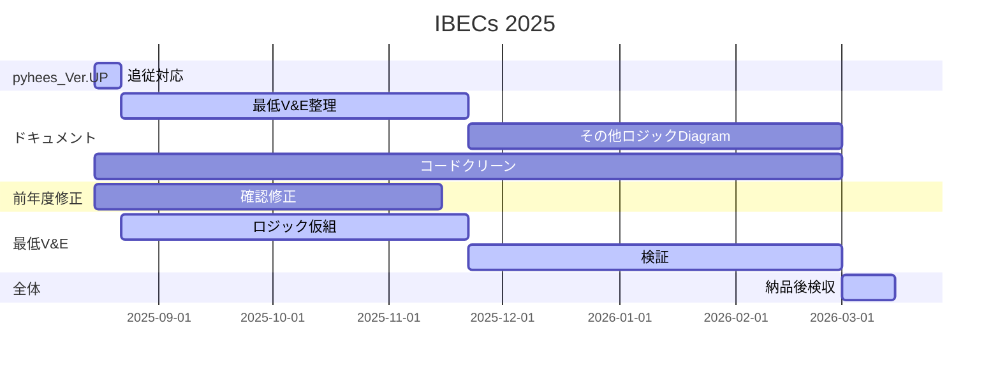

### IBECs2025の大まかなスケジュール

大まかな作業予定を図化しました。
昨年度のプロジェクトのレビューで提案された、仮納品のような考え方を組込んでいます。

追加機能の最低風量電力機能ですが、年末までに、ロジックの仮組が完了する予定で
一旦実行できるようになりましたら仮納品として検証作業に入れます。
つまり納品後の検収2週間とは別に、検証期間を設けていますがいかがでしょうか。
今期は昨年より速くスタートを切れるためこれが可能になっています。

