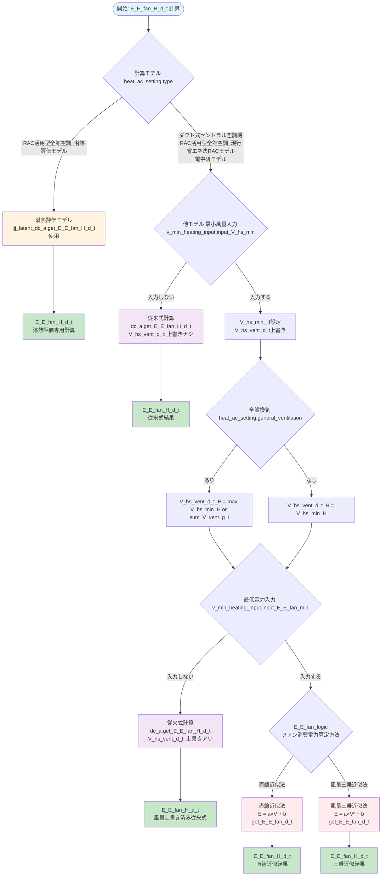

# F25-01 最低風量・最低電力 ロジックフロー

## 概要
暖房時の送風機消費電力量 `E_E_fan_H_d_t` 計算における、空調システム種別とユーザー入力設定による分岐パターンを示します。

## フローダイアグラム



## パターン概要

### 1. 潜熱評価モデル
- **タイプ**: `RAC活用型全館空調_潜熱評価モデル`
- **ロジック**: 潜熱評価専用計算
- **結果**: `jjj_latent_dc_a.get_E_E_fan_H_d_t` 使用

### 2. 従来式
- **タイプ**: `ダクト式セントラル空調機`, `RAC活用型全館空調_現行省エネ法RACモデル`, `電中研モデル`
- **条件**: `input_V_hs_min = 入力しない`
- **ロジック**: 最低風量上書きなしの標準計算
- **結果**: 元の `V_hs_vent_d_t` で `dc_a.get_E_E_fan_H_d_t` 実行

### 3. 風量上書き
- **条件**: `input_V_hs_min = 入力する` + `input_E_E_fan_min = 入力しない`
- **ロジック**: 全般換気機能設定に基づく換気風量上書き
- **全般換気あり**: `V_hs_vent_d_t[H] = max(V_hs_min_H, sum(V_vent_g_i))`
- **全般換気なし**: `V_hs_vent_d_t[H] = V_hs_min_H`
- **結果**: 修正済み `V_hs_vent_d_t` で `dc_a.get_E_E_fan_H_d_t` 実行

### 4. 完全カスタム
- **条件**: `input_V_hs_min = 入力する` + `input_E_E_fan_min = 入力する`
- **ロジック**: 風量と電力両方のカスタマイズ
- **算定方法選択**: `E_E_fan_logic` により2種類の公式から選択
  - **直線近似法**: `E = a × V + b` (従来式)
  - **風量三乗近似法**: `E = a × V³ + b`
- **結果**: `E_E_fan_min_H` パラメータで `get_E_E_fan_d_t` 実行

## 主要変数
- `V_hs_min_H`: 最低風量 [m³/h]
- `E_E_fan_min_H`: 最低電力 [W]
- `V_hs_vent_d_t`: 換気風量 (暖房期間修正済み)
- `HCM`: 暖冷房区分 (H = 暖房期間)
- `E_E_fan_logic`: ファン消費電力算定方法

## 算定公式詳細

### 直線近似法 (従来式)
```
E_E_fan = a × V_hs_supply + b
a = (P_fan_rtd - E_E_fan_min) / (V_hs_dsgn - V_hs_min)
b = E_E_fan_min - a × V_hs_min
```

### 風量三乗近似法
```
E_E_fan = a × V_hs_supply³ + b
a = (P_fan_rtd - E_E_fan_min) / (V_hs_dsgn³ - V_hs_min³)
b = E_E_fan_min - a × V_hs_min³
```

**共通仕様:**
- 最低点: (V_hs_min, E_E_fan_min)
- 定格点: (V_hs_dsgn, P_fan_rtd)
- サーモOFF時: V_hs_supply → V_hs_vent (V_hs_min)