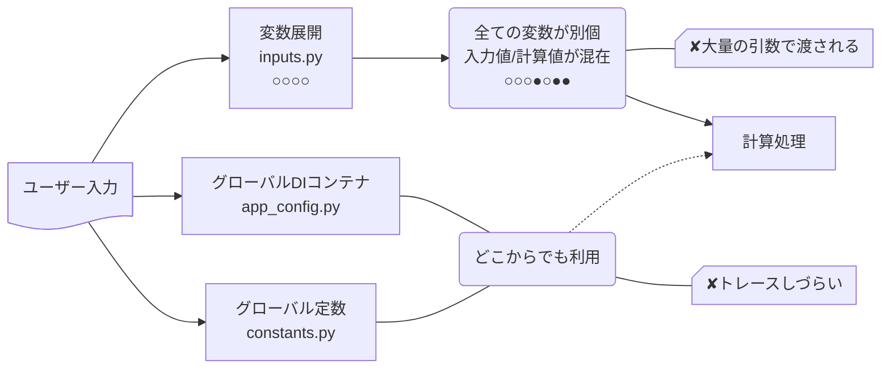
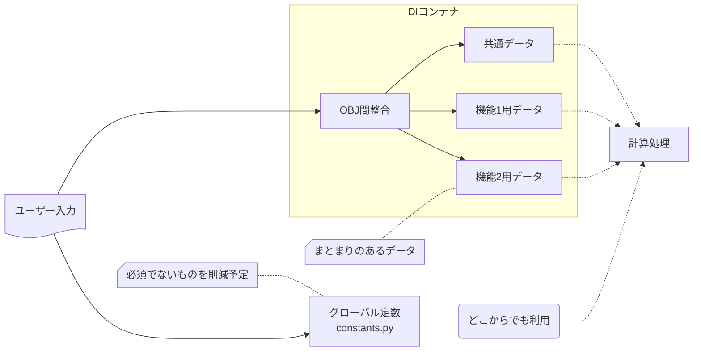

### 旧インプット

### 新インプット

### 比較表

| 観点                 | BEFORE             | AFTER                  |
| -------------------- | ------------------ | ---------------------- |
| 変数の数             | 多い(全てバラバラ) | 少ない(関連でまとまり) |
| 入力値/計算値の区別  | つかない           | つく                   |
| 入力値が所属する機能 | コードから読取     | ファイルで分割         |
| グローバル定数の数   | 多い               | 少ない                 |
