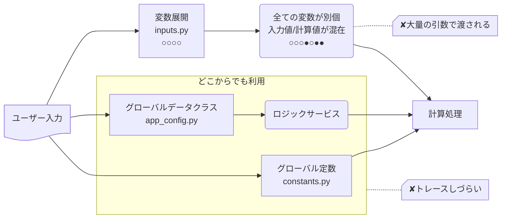
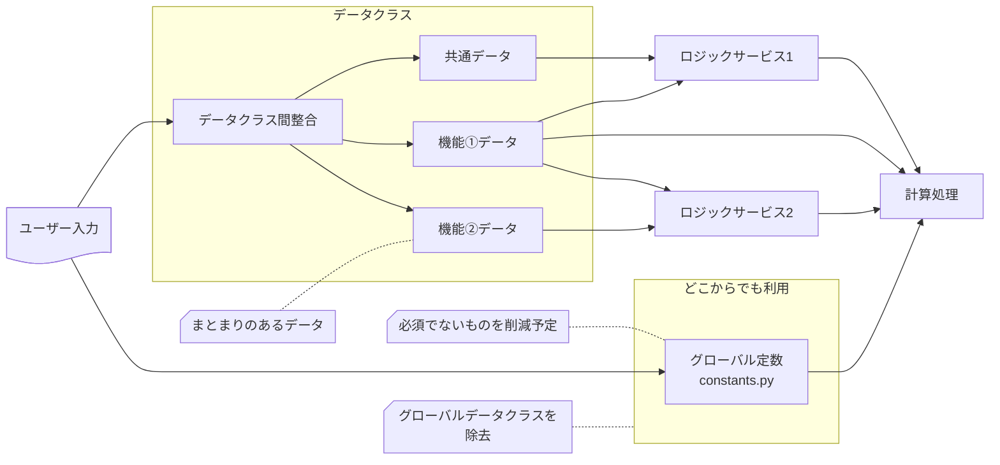

### 旧インプット

### 比較表

| 観点                 | BEFORE             | AFTER                  |
| -------------------- | ------------------ | ---------------------- |
| 変数の数             | 多い(全てバラバラ) | 少ない(関連でまとまり) |
| フローの数           | ３本(違いが曖昧)   | ２本(違いが明確)       |
| 入力値/計算値の区別  | つかない           | つく                   |
| 入力値が所属する機能 | ロジック内に埋没   | ファイル配置で明確化   |
| グローバル定数の数   | 多い               | 減らしやすい           |

### 新インプット

